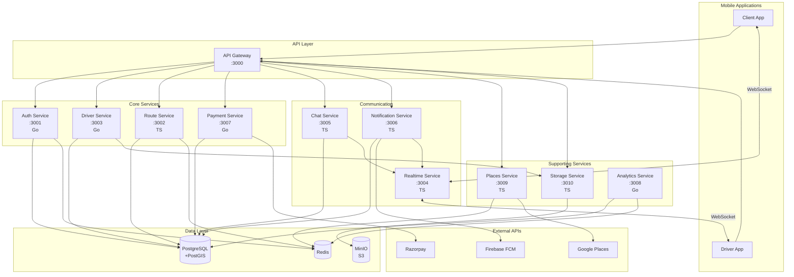
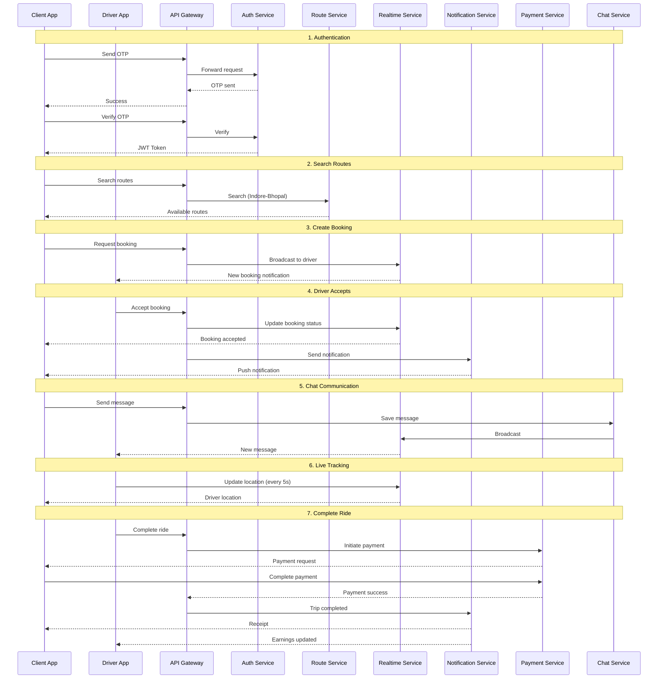
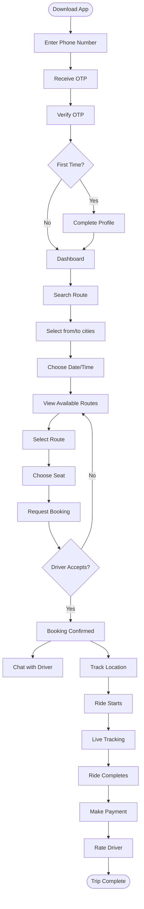
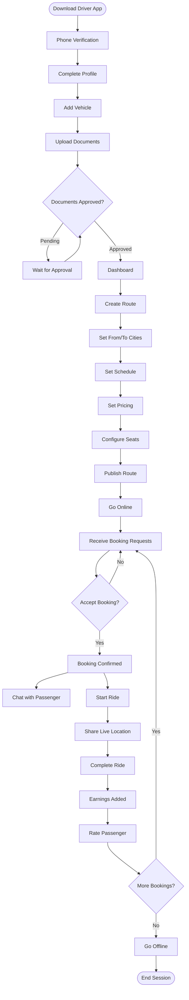
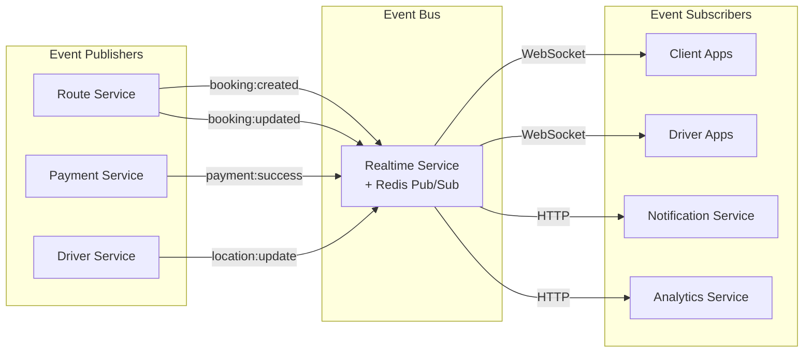
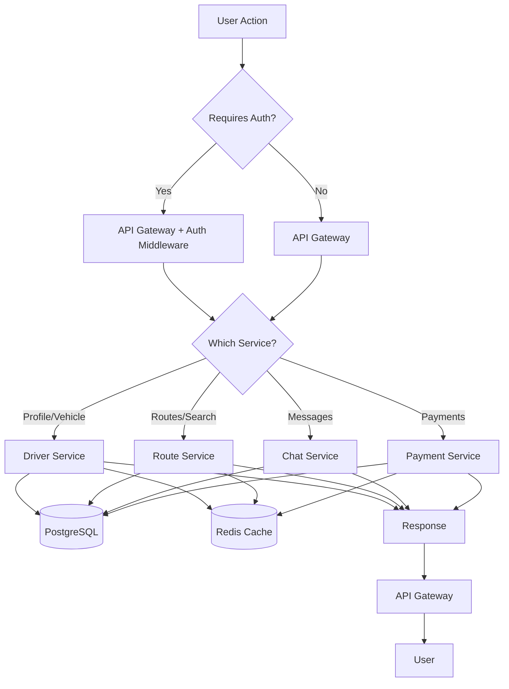
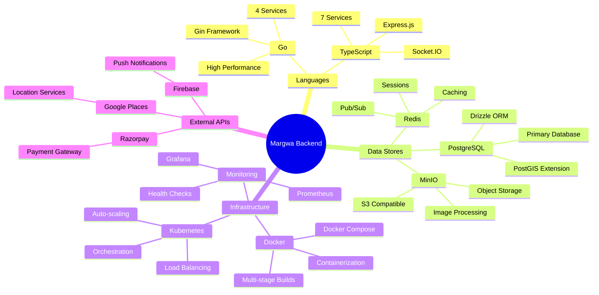

# Margwa Backend - Complete API Integration Flow

Visual guide to how all Margwa services work together.

## Complete System Architecture

## Complete Booking Flow

## User Workflows

### Client Journey

### Driver Journey

## Service Integration Patterns

### Event-Driven Architecture

### Data Flow Patterns

## Technology Stack Summary

## Quick Reference

### Service Ports

| Port | Service | Tech | Purpose |
|------|---------|------|---------|
| 3000 | API Gateway | TS | Main entry point |
| 3001 | Auth Service | Go | OTP authentication |
| 3002 | Route Service | TS | Route management |
| 3003 | Driver Service | Go | Driver profiles |
| 3004 | Realtime Service | TS | WebSocket |
| 3005 | Chat Service | TS | Messaging |
| 3006 | Notification Service | TS | Push notifications |
| 3007 | Payment Service | Go | Payments |
| 3008 | Analytics Service | Go | Analytics |
| 3009 | Places Service | TS | Google Places |
| 3010 | Storage Service | TS | MinIO storage |

### Database Tables

- **users** - User accounts
- **drivers** - Driver profiles
- **vehicles** - Vehicle registration
- **routes** - Route definitions
- **route_instances** - Scheduled routes
- **bookings** - Ride bookings
- **payments** - Payment records
- **conversations** - Chat conversations
- **messages** - Chat messages
- **notifications** - Push notifications
- **driver_documents** - Document verification

### Key Features

- ✅ OTP-based authentication
- ✅ Real-time location tracking
- ✅ Live chat messaging
- ✅ Push notifications
- ✅ Payment processing (Razorpay)
- ✅ Image upload & compression
- ✅ Auto-scaling (Kubernetes)
- ✅ Load balancing (NGINX)
- ✅ Caching (Redis)
- ✅ Monitoring (Prometheus/Grafana)

---

For detailed API documentation, see [API.md](./API.md).  
For deployment workflows, see [COMPLETE_WORKFLOW.md](./COMPLETE_WORKFLOW.md).
