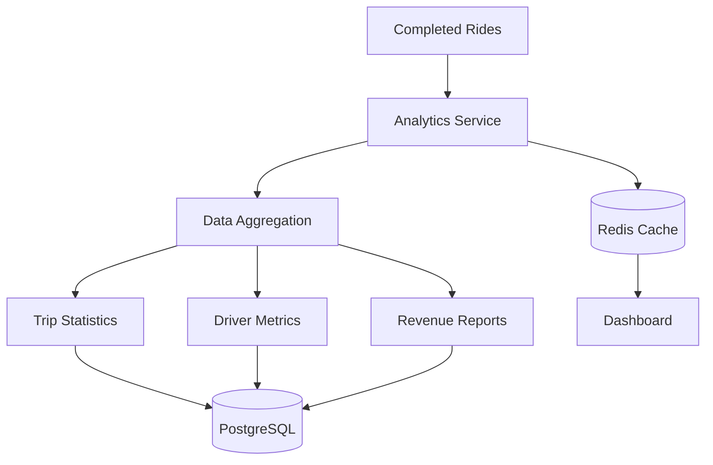
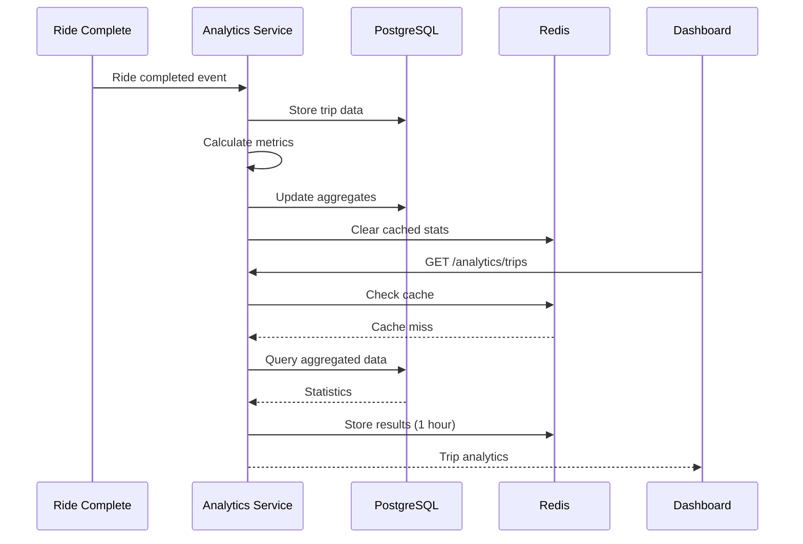
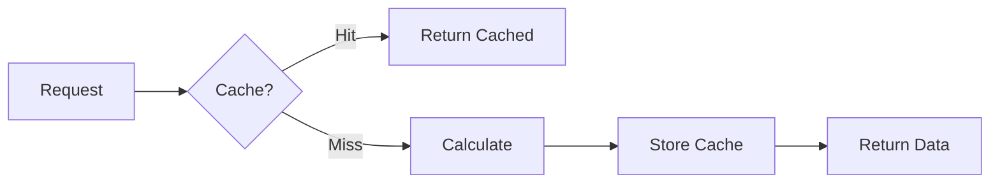

# Analytics Service

Analytics and reporting service for Margwa platform.

## Overview

Built with **Go** and **Gin framework**, providing:
- Trip analytics and statistics
- Driver performance metrics
- Revenue reporting
- Usage analytics
- Custom reports

## Port

**3008**

## Technology Stack

- Go 1.21+
- Gin Web Framework
- PostgreSQL (data source)
- Redis (caching)
- Time-series data processing

## Architecture



## API Endpoints

### Get Trip Analytics
```
GET /api/v1/analytics/trips/:driverId?period=week
Authorization: Bearer <token>
```

Response:
```json
{
  "success": true,
  "data": {
    "period": "week",
    "totalTrips": 42,
    "completedTrips": 39,
    "cancelledTrips": 3,
    "totalDistance": 1250.5,
    "totalEarnings": 18500,
    "averageRating": 4.7,
    "peakHours": ["08:00-10:00", "18:00-20:00"]
  }
}
```

### Get Revenue Report
```
GET /api/v1/analytics/revenue/:driverId?startDate=2024-01-01&endDate=2024-01-31
Authorization: Bearer <token>
```

Response:
```json
{
  "success": true,
  "data": {
    "totalRevenue": 75000,
    "platformFees": 15000,
    "netEarnings": 60000,
    "tripsCount": 180,
    "averagePerTrip": 416.67,
    "dailyBreakdown": [
      {
        "date": "2024-01-01",
        "revenue": 2500,
        "trips": 6
      }
    ]
  }
}
```

### Get Driver Performance
```
GET /api/v1/analytics/performance/:driverId
Authorization: Bearer <token>
```

Response:
```json
{
  "success": true,
  "data": {
    "overallRating": 4.8,
    "totalReviews": 156,
    "acceptanceRate": 92.5,
    "cancellationRate": 2.5,
    "averageResponseTime": 45,
    "onTimePercentage": 95.5,
    "badges": ["5-star-driver", "early-bird", "weekend-warrior"]
  }
}
```

### Platform Analytics (Admin)
```
GET /api/v1/analytics/platform?period=month
Authorization: Bearer <admin-token>
```

Response:
```json
{
  "success": true,
  "data": {
    "totalUsers": 5000,
    "activeDrivers": 450,
    "totalTrips": 8500,
    "grossRevenue": 3750000,
    "platformRevenue": 750000,
    "averageRideValue": 441.18,
    "topRoutes": [
      {"route": "Indore-Bhopal", "count": 850},
      {"route": "Mumbai-Pune", "count": 620}
    ]
  }
}
```

## Analytics Workflow



## Metrics Collected

### Trip Metrics
- Total trips
- Completed vs cancelled
- Distance traveled
- Duration
- Revenue generated

### Driver Metrics
- Acceptance rate
- Cancellation rate
- Average rating
- Response time
- On-time percentage

### Platform Metrics
- Active users
- Total revenue
- Popular routes
- Peak hours
- Growth trends

## Database Schema

### trip_analytics Table
```sql
CREATE TABLE trip_analytics (
  id UUID PRIMARY KEY,
  driver_id UUID REFERENCES drivers(id),
  booking_id UUID REFERENCES bookings(id),
  trip_date DATE,
  distance_km DECIMAL(6,2),
  duration_minutes INTEGER,
  fare_amount DECIMAL(10,2),
  rating DECIMAL(2,1),
  created_at TIMESTAMP DEFAULT NOW(),
  INDEX idx_driver_date (driver_id, trip_date)
);
```

### driver_metrics Table
```sql
CREATE TABLE driver_metrics (
  id UUID PRIMARY KEY,
  driver_id UUID REFERENCES drivers(id) UNIQUE,
  total_trips INTEGER DEFAULT 0,
  completed_trips INTEGER DEFAULT 0,
  cancelled_trips INTEGER DEFAULT 0,
  total_earnings DECIMAL(12,2) DEFAULT 0,
  average_rating DECIMAL(3,2),
  acceptance_rate DECIMAL(5,2),
  updated_at TIMESTAMP DEFAULT NOW()
);
```

## Time Periods

Supported periods for analytics:
- `day` - Today's data
- `week` - Last 7 days
- `month` - Last 30 days
- `year` - Last 365 days
- `custom` - Specify startDate and endDate

## Caching Strategy



### Cache Keys
- `analytics:trips:{driverId}:{period}`
- `analytics:revenue:{driverId}:{startDate}:{endDate}`
- `analytics:performance:{driverId}`
- `analytics:platform:{period}`

### TTL
- Real-time metrics: 5 minutes
- Daily stats: 1 hour
- Monthly reports: 24 hours

## Environment Variables

```env
ANALYTICS_SERVICE_PORT=3008
DATABASE_URL=postgresql://...
REDIS_URL=redis://...
JWT_SECRET=your-secret

# Analytics specific
ANALYTICS_CACHE_TTL=3600
METRICS_AGGREGATION_INTERVAL=300
```

## Development

```bash
cd services/analytics-service
go mod download
go run main.go
```

## Testing

```bash
# Get trip analytics
curl -H "Authorization: Bearer <token>" \
  "http://localhost:3000/api/v1/analytics/trips/driver-uuid?period=week"

# Get revenue report
curl -H "Authorization: Bearer <token>" \
  "http://localhost:3000/api/v1/analytics/revenue/driver-uuid?startDate=2024-01-01&endDate=2024-01-31"
```

## Features

### Real-time Updates
- Metrics updated on trip completion
- Cache invalidation on data change
- Near real-time dashboard

### Historical Trends
- Day-over-day comparison
- Week-over-week growth  
- Monthly trends
- Year-over-year comparison

### Custom Reports
- Date range selection
- Driver comparison
- Route performance
- Revenue breakdown

## Performance Optimization

1. **Materialized Views**: Pre-aggregated data
2. **Partitioning**: Time-based table partitioning
3. **Indexing**: Optimized for common queries
4. **Caching**: Redis for frequently accessed metrics

---

Complete API docs: [/docs/API.md](../../docs/API.md)
