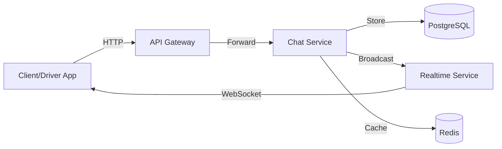
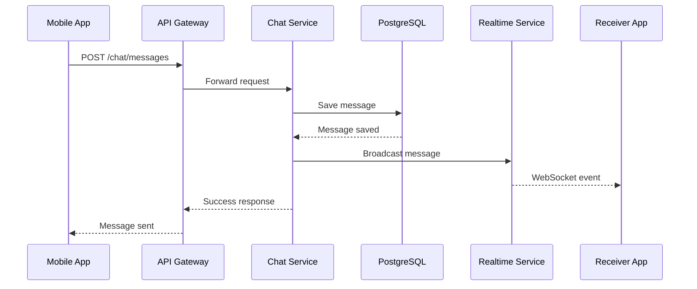

# Chat Service

Real-time messaging service for Margwa platform.

## Overview

Built with **TypeScript** and **Express.js**, providing:
- Conversation management
- Message persistence
- Real-time message delivery (via Realtime Service)
- Unread message tracking
- Message history and pagination

## Port

**3005**

## Technology Stack

- TypeScript
- Express.js
- PostgreSQL (message storage)
- Redis (caching)
- Socket.IO integration

## Architecture



## API Flow

### Send Message Flow



## API Endpoints

### Create/Get Conversation
```
POST /api/v1/chat/conversations
Authorization: Bearer <token>
```

Request:
```json
{
  "bookingId": "booking-uuid",
  "clientId": "client-uuid",
  "driverId": "driver-uuid"
}
```

Response:
```json
{
  "success": true,
  "data": {
    "id": "conversation-uuid",
    "bookingId": "booking-uuid",
    "clientId": "client-uuid",
    "driverId": "driver-uuid",
    "createdAt": "2024-01-15T10:00:00Z"
  }
}
```

### Send Message
```
POST /api/v1/chat/messages
Authorization: Bearer <token>
```

Request:
```json
{
  "conversationId": "conversation-uuid",
  "senderId": "user-uuid",
  "receiverId": "user-uuid",
  "messageText": "Hello, I'm on my way!",
  "messageType": "text"
}
```

### Get Messages
```
GET /api/v1/chat/messages/:conversationId?page=1&limit=50
Authorization: Bearer <token>
```

Response:
```json
{
  "success": true,
  "data": {
    "data": [
      {
        "id": "message-uuid",
        "conversationId": "conv-uuid",
        "senderId": "user-uuid",
        "messageText": "Hello!",
        "messageType": "text",
        "isRead": false,
        "createdAt": "2024-01-15T10:00:00Z"
      }
    ],
    "pagination": {
      "page": 1,
      "limit": 50,
      "total": 120,
      "pages": 3
    }
  }
}
```

### Mark Messages as Read
```
PUT /api/v1/chat/messages/:conversationId/read
Authorization: Bearer <token>
```

Request:
```json
{
  "userId": "user-uuid"
}
```

### Get User Conversations
```
GET /api/v1/chat/conversations/user/:userId
Authorization: Bearer <token>
```

### Get Unread Count
```
GET /api/v1/chat/unread/:userId
Authorization: Bearer <token>
```

Response:
```json
{
  "success": true,
  "data": {
    "unreadCount": 5
  }
}
```

## Message Types

- `text`: Plain text message
- `image`: Image message
- `location`: Location share
- `system`: System-generated message

## Database Schema

### conversations Table
```sql
CREATE TABLE conversations (
  id UUID PRIMARY KEY,
  booking_id UUID REFERENCES bookings(id),
  client_id UUID REFERENCES users(id),
  driver_id UUID REFERENCES users(id),
  created_at TIMESTAMP DEFAULT NOW(),
  UNIQUE(booking_id)
);
```

### messages Table
```sql
CREATE TABLE messages (
  id UUID PRIMARY KEY,
  conversation_id UUID REFERENCES conversations(id),
  sender_id UUID REFERENCES users(id),
  receiver_id UUID REFERENCES users(id),
  message_text TEXT,
  message_type VARCHAR(20) DEFAULT 'text',
  is_read BOOLEAN DEFAULT FALSE,
  created_at TIMESTAMP DEFAULT NOW(),
  INDEX idx_conversation (conversation_id),
  INDEX idx_unread (receiver_id, is_read)
);
```

## Real-time Integration

Messages are delivered via both HTTP API and WebSocket:

1. **HTTP**: Persistent storage and history
2. **WebSocket**: Real-time delivery to active users

```javascript
// After saving message to DB
await fetch('http://localhost:3004/broadcast', {
  method: 'POST',
  body: JSON.stringify({
    event: 'chat:message',
    room: `user:${receiverId}`,
    data: messageData
  })
});
```

## Environment Variables

```env
CHAT_SERVICE_PORT=3005
DATABASE_URL=postgresql://...
REDIS_URL=redis://...
JWT_SECRET=your-secret
REALTIME_SERVICE_URL=http://localhost:3004
```

## Development

```bash
cd services/chat-service
npm install
npm run dev
```

## Testing

```bash
# Create conversation
curl -X POST http://localhost:3000/api/v1/chat/conversations \
  -H "Authorization: Bearer <token>" \
  -H "Content-Type: application/json" \
  -d '{
    "bookingId": "booking-uuid",
    "clientId": "client-uuid",
    "driverId": "driver-uuid"
  }'

# Send message
curl -X POST http://localhost:3000/api/v1/chat/messages \
  -H "Authorization: Bearer <token>" \
  -H "Content-Type: application/json" \
  -d '{
    "conversationId": "conv-uuid",
    "senderId": "user-uuid",
    "receiverId": "other-uuid",
    "messageText": "Hello!"
  }'
```

## Features

### Message Pagination
- Load older messages in chunks
- Efficient for long conversations
- Default: 50 messages per page

### Unread Tracking
- Track which messages are read
- Unread count per user
- Mark all as read functionality

### Conversation Linking
- One conversation per booking
- Easy message history access
- Driver-client communication

## Performance

- **Indexed Queries**: Fast message retrieval
- **Redis Caching**: Unread counts cached
- **Pagination**: Efficient large conversations
- **WebSocket Delivery**: Instant message delivery

---

Complete API docs: [/docs/API.md](../../docs/API.md)
