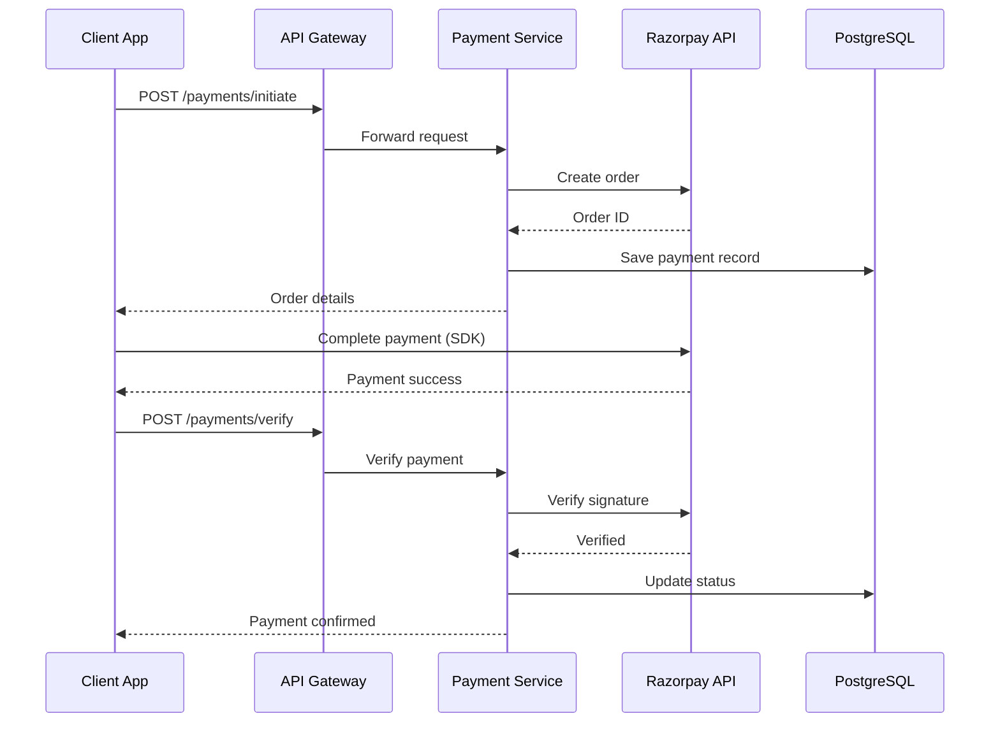
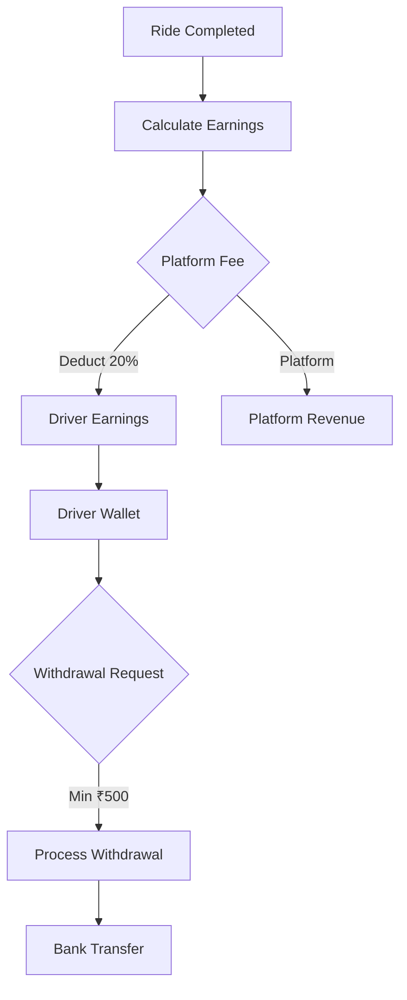
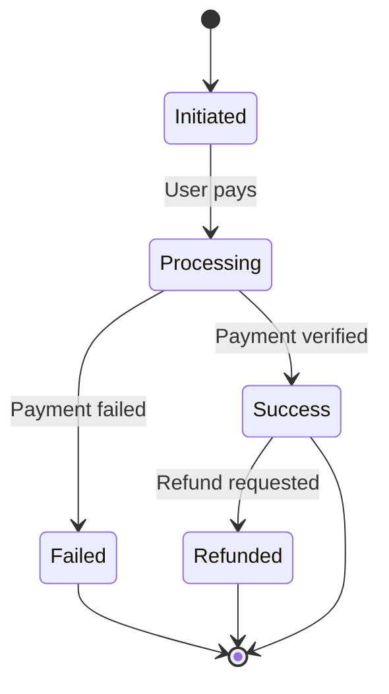

# Payment Service

Payment processing and earnings management service for Margwa.

## Overview

Built with **Go** and **Gin framework**, handling:
- Payment initiation and verification
- Razorpay integration
- Refund processing
- Earnings calculation
- Withdrawal management

## Port

**3007**

## Technology Stack

- Go 1.21+
- Gin Web Framework
- PostgreSQL
- Redis
- Razorpay Payment Gateway

## Payment Flow



## Earnings Flow



## API Endpoints

### Initiate Payment
```
POST /api/v1/payments/initiate
Authorization: Bearer <token>
```

Request:
```json
{
  "bookingId": "booking-uuid",
  "amount": 450,
  "currency": "INR"
}
```

Response:
```json
{
  "success": true,
  "data": {
    "orderId": "order_xyz123",
    "amount": 450,
    "currency": "INR",
    "razorpayKeyId": "rzp_test_...",
    "bookingId": "booking-uuid"
  }
}
```

### Verify Payment
```
POST /api/v1/payments/verify
Authorization: Bearer <token>
```

Request:
```json
{
  "orderId": "order_xyz123",
  "paymentId": "pay_abc456",
  "signature": "signature_string"
}
```

### Get Payment
```
GET /api/v1/payments/:bookingId
Authorization: Bearer <token>
```

### Process Refund
```
POST /api/v1/payments/refund
Authorization: Bearer <token>
```

Request:
```json
{
  "paymentId": "pay_abc456",
  "amount": 450,
  "reason": "Ride cancelled by driver"
}
```

### Calculate Earnings
```
POST /api/v1/earnings/calculate
Authorization: Bearer <token>
```

Request:
```json
{
  "bookingId": "booking-uuid",
  "fareAmount": 450,
  "distance": 195
}
```

Response:
```json
{
  "success": true,
  "data": {
    "fareAmount": 450,
    "platformFee": 90,
    "driverEarnings": 360,
    "platformFeePercentage": 20
  }
}
```

### Get Driver Earnings
```
GET /api/v1/earnings/driver/:driverId
Authorization: Bearer <token>
```

Response:
```json
{
  "success": true,
  "data": {
    "totalEarnings": 15000,
    "availableBalance": 5000,
    "withdrawnAmount": 10000,
    "pendingAmount": 500
  }
}
```

### Process Withdrawal
```
POST /api/v1/earnings/withdraw
Authorization: Bearer <token>
```

Request:
```json
{
  "driverId": "driver-uuid",
  "amount": 5000,
  "bankAccountId": "account-uuid"
}
```

### Payment Webhook
```
POST /api/v1/payments/webhook
```

Razorpay sends payment notifications here.

## Database Schema

### payments Table
```sql
CREATE TABLE payments (
  id UUID PRIMARY KEY,
  booking_id UUID REFERENCES bookings(id),
  order_id VARCHAR(100) UNIQUE,
  payment_id VARCHAR(100),
  amount DECIMAL(10,2),
  currency VARCHAR(3) DEFAULT 'INR',
  status VARCHAR(20) DEFAULT 'pending',
  payment_method VARCHAR(50),
  created_at TIMESTAMP DEFAULT NOW(),
  updated_at TIMESTAMP DEFAULT NOW()
);
```

### earnings Table
```sql
CREATE TABLE earnings (
  id UUID PRIMARY KEY,
  driver_id UUID REFERENCES drivers(id),
  booking_id UUID REFERENCES bookings(id),
  fare_amount DECIMAL(10,2),
  platform_fee DECIMAL(10,2),
  driver_earnings DECIMAL(10,2),
  status VARCHAR(20) DEFAULT 'pending',
  created_at TIMESTAMP DEFAULT NOW()
);
```

### withdrawals Table
```sql
CREATE TABLE withdrawals (
  id UUID PRIMARY KEY,
  driver_id UUID REFERENCES drivers(id),
  amount DECIMAL(10,2),
  bank_account_id UUID,
  status VARCHAR(20) DEFAULT 'pending',
  processed_at TIMESTAMP,
  created_at TIMESTAMP DEFAULT NOW()
);
```

## Razorpay Integration

### Configuration

```go
import "github.com/razorpay/razorpay-go"

client := razorpay.NewClient(
    os.Getenv("RAZORPAY_KEY_ID"),
    os.Getenv("RAZORPAY_KEY_SECRET"),
)
```

### Create Order

```go
data := map[string]interface{}{
    "amount":   45000, // in paise
    "currency": "INR",
}

order, err := client.Order.Create(data, nil)
```

### Verify Signature

```go
params := map[string]interface{}{
    "razorpay_order_id":   orderId,
    "razorpay_payment_id": paymentId,
    "razorpay_signature":  signature,
}

err := client.Payment.VerifySignature(params)
```

## Environment Variables

```env
PAYMENT_SERVICE_PORT=3007
DATABASE_URL=postgresql://...
REDIS_URL=redis://...
JWT_SECRET=your-secret

# Razorpay
RAZORPAY_KEY_ID=rzp_test_...
RAZORPAY_KEY_SECRET=your-secret
RAZORPAY_WEBHOOK_SECRET=webhook-secret

# Earnings
PLATFORM_FEE_PERCENTAGE=20
MIN_WITHDRAWAL_AMOUNT=500
```

## Payment States



## Development

```bash
cd services/payment-service
go mod download
go run main.go
```

## Testing

### Test Mode

Use Razorpay test keys for development:
- Test Card: 4111 1111 1111 1111
- CVV: Any 3 digits
- Expiry: Any future date

```bash
# Initiate payment
curl -X POST http://localhost:3000/api/v1/payments/initiate \
  -H "Authorization: Bearer <token>" \
  -H "Content-Type: application/json" \
  -d '{
    "bookingId": "booking-uuid",
    "amount": 450
  }'
```

## Security

- **Signature Verification**: All payments verified via Razorpay signature
- **Webhook Validation**: Webhook requests validated
- **Amount Validation**: Server-side amount verification
- **Idempotency**: Prevent duplicate payments
- **PCI Compliance**: No card data stored

## Error Handling

Common errors:
- `400` - Invalid payment details
- `402` - Payment failed
- `404` - Order not found
- `409` - Duplicate payment
- `500` - Razorpay API error

---

Complete API docs: [/docs/API.md](../../docs/API.md)  
Razorpay docs: https://razorpay.com/docs/
