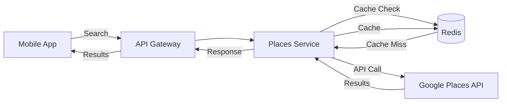
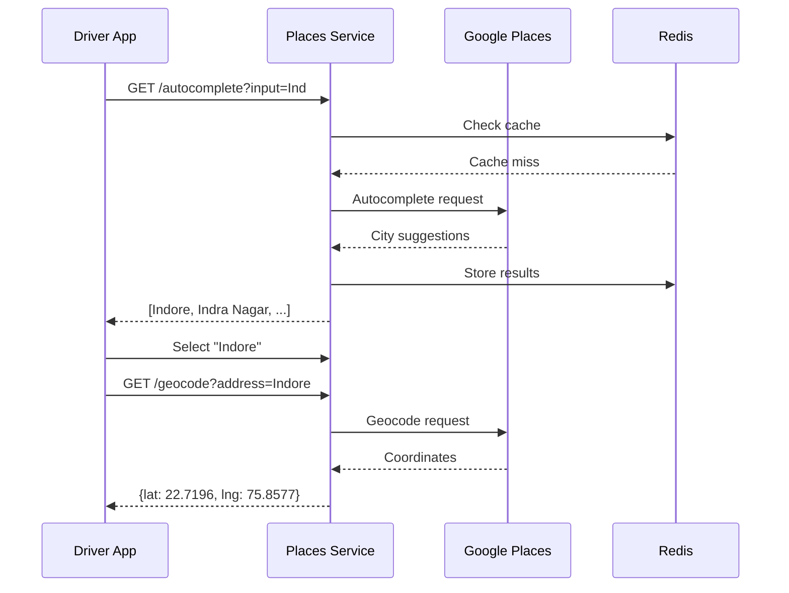
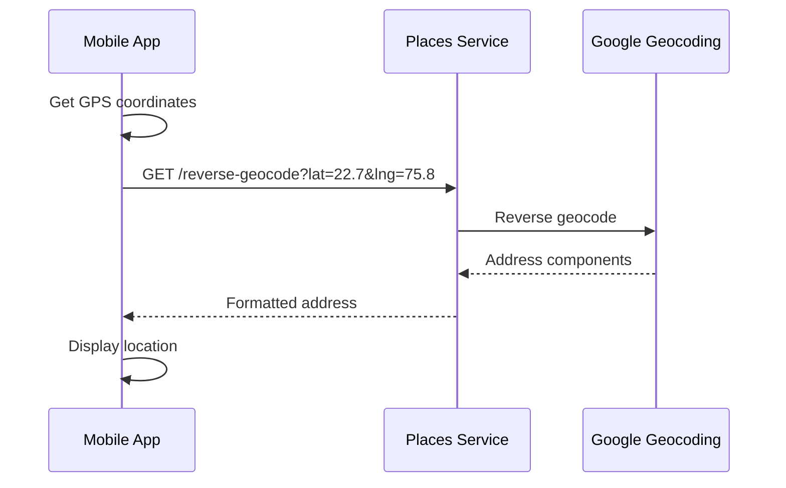

# Places Service

Google Places API integration for location services.

## Overview

Built with **TypeScript** and **Express.js**, providing:
- Place autocomplete
- Geocoding (address → coordinates)
- Reverse geocoding (coordinates → address)
- Place details lookup

## Port

**3009**

## Technology Stack

- TypeScript
- Express.js
- Google Places API
- Google Geocoding API
- Redis (caching)

## Architecture



## API Endpoints

### Autocomplete
```
GET /api/v1/places/autocomplete?input=Indore&types=city
```

Response:
```json
{
  "success": true,
  "data": {
    "predictions": [
      {
        "placeId": "ChIJ...",
        "description": "Indore, Madhya Pradesh, India",
        "mainText": "Indore",
        "secondaryText": "Madhya Pradesh, India",
        "types": ["locality", "political"]
      }
    ]
  }
}
```

### Geocode
```
GET /api/v1/places/geocode?address=Indore, MP
```

Response:
```json
{
  "success": true,
  "data": {
    "latitude": 22.7196,
    "longitude": 75.8577,
    "formattedAddress": "Indore, Madhya Pradesh, India",
    "placeId": "ChIJ..."
  }
}
```

### Reverse Geocode
```
GET /api/v1/places/reverse-geocode?lat=22.7196&lng=75.8577
```

Response:
```json
{
  "success": true,
  "data": {
    "formattedAddress": "Vijay Nagar, Indore, Madhya Pradesh 452010, India",
    "city": "Indore",
    "state": "Madhya Pradesh",
    "country": "India",
    "postalCode": "452010"
  }
}
```

### Place Details
```
GET /api/v1/places/details/:placeId
```

Response:
```json
{
  "success": true,
  "data": {
    "placeId": "ChIJ...",
    "name": "Indore",
    "formattedAddress": "Indore, Madhya Pradesh, India",
    "latitude": 22.7196,
    "longitude": 75.8577,
    "types": ["locality", "political"]
  }
}
```

## Use Cases

### 1. City Search (Route Creation)



### 2. Location Tracking (Reverse Geocode)



## Caching Strategy

### Cache Keys
```
autocomplete:{input}:{types}
geocode:{address}
reverse-geocode:{lat}:{lng}:{radius}
place-details:{placeId}
```

### TTL
- Autocomplete: 24 hours
- Geocoding: 7 days (addresses rarely change)
- Reverse geocoding: 24 hours
- Place details: 30 days

## Environment Variables

```env
PLACES_SERVICE_PORT=3009
REDIS_URL=redis://localhost:6379
JWT_SECRET=your-secret

# Google APIs
GOOGLE_MAPS_API_KEY=your-google-api-key
GOOGLE_PLACES_API_KEY=your-places-key  # Optional, can use same key
```

## Development

```bash
cd services/places-service
npm install
npm run dev
```

## Testing

```bash
# Autocomplete cities
curl "http://localhost:3000/api/v1/places/autocomplete?input=Indore&types=city"

# Geocode address
curl "http://localhost:3000/api/v1/places/geocode?address=Indore,%20MP"

# Reverse geocode
curl "http://localhost:3000/api/v1/places/reverse-geocode?lat=22.7196&lng=75.8577"
```

## Features

### Type Filtering

Supported types:
- `city` - Cities only
- `locality` - Localities and cities
- `address` - Street addresses
- `establishment` - Businesses

### Region Biasing

Bias results to India:
```
?input=Mumbai&region=in
```

### Autocomplete Session Tokens

For cost optimization, use session tokens:
```javascript
const sessionToken = generateSessionToken();
await autocomplete(input, { sessionToken });
```

## Cost Optimization

1. **Caching**: Reduce API calls by 80%
2. **Session Tokens**: Save on autocomplete costs
3. **Debouncing**: Wait for user to stop typing
4. **Result Limits**: Limit results to 5-10

## Google API Setup

1. Go to [Google Cloud Console](https://console.cloud.google.com)
2. Create project or select existing
3. Enable APIs:
   - Places API
   - Geocoding API
   - Maps JavaScript API (for mobile apps)
4. Create API key
5. Restrict API key:
   - HTTP referrers (for web)
   - IP addresses (for servers)
   - API restrictions (specific APIs only)

## Error Handling

```json
{
  "success": false,
  "error": {
    "code": "PLACES_API_ERROR",
    "message": "Google Places API error",
    "details": {
      "status": "ZERO_RESULTS",
      "errorMessage": "No results found"
    }
  }
}
```

Common errors:
- `ZERO_RESULTS` - No results for query
- `OVER_QUERY_LIMIT` - API quota exceeded
- `REQUEST_DENIED` - Invalid API key
- `INVALID_REQUEST` - Missing parameters

## Performance

- **Response Time**: <100ms (cached), <500ms (API call)
- **Cache Hit Rate**: ~85%
- **API Quota**: Monitor usage dashboard

---

Google Places API docs: https://developers.google.com/maps/documentation/places/web-service
