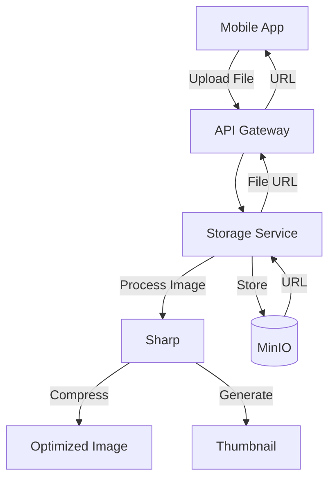
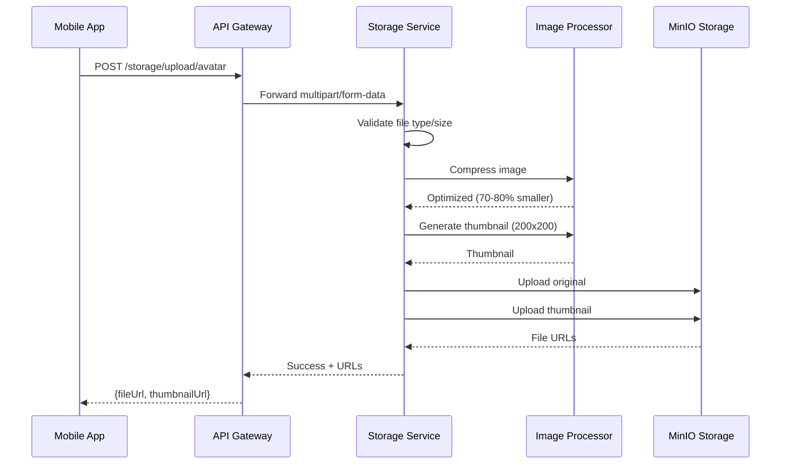

# Storage Service

MinIO-based object storage service for Margwa platform with image processing.

## Overview

Built with **TypeScript** and **Express.js**, providing:
- S3-compatible object storage via MinIO
- Image upload and compression (70-80% size reduction)
- Automatic thumbnail generation
- Document storage (licenses, permits, etc.)
- Secure file access control

## Port

**3010**

## Architecture



## Upload Flow



## API Endpoints

### Upload Avatar
```
POST /api/v1/storage/upload/avatar
Content-Type: multipart/form-data
```

### Upload Driver Document
```
POST /api/v1/storage/upload/driver-document
```

### Upload Vehicle Document
```
POST /api/v1/storage/upload/vehicle-document
```

## Buckets

- `avatars` - User profile images (public)
- `driver-documents` - Driver licenses, permits (private)
- `vehicle-documents` - RC, Insurance, PUC (private)
- `temp-uploads` - Temporary storage

## Environment Variables

```env
STORAGE_SERVICE_PORT=3010
MINIO_ENDPOINT=localhost
MINIO_PORT=9000
MINIO_ACCESS_KEY=margwa_admin
MINIO_SECRET_KEY=margwa_minio_secret_2024
MINIO_USE_SSL=false
```

## Development

```bash
cd services/storage-service
npm install
npm run dev
```

## MinIO Console

Access at: http://localhost:9001
- Username: `margwa_admin`
- Password: `margwa_minio_secret_2024`

---

Complete docs: [QUICKSTART.md](./QUICKSTART.md)
